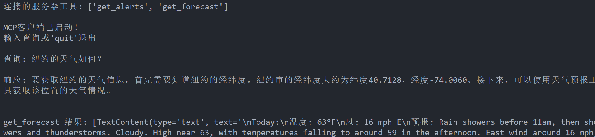

# MCP-Demo
> [MCP官方中文文档](https://mcp-docs.cn/quickstart/server)

由于没有US的手机号，拼尽全力也无法获得Claude的可用api，最后只能让"DeepSeekR1"把客户端部分的代码修改了一下，现在接入的是siliconflow的DeepSeekV3模型。

**使用方法**:先按照官方文档里的教程配置环境，然后在.env里填入siliconflow的APIkey，最后在mcp-client目录下运行`python client.py ../weather/weather.py`启动客户端

测试结果:虽然还有很多bug，但是demo能跑。也说明了mcp接入deepseek这种模型的可行性。