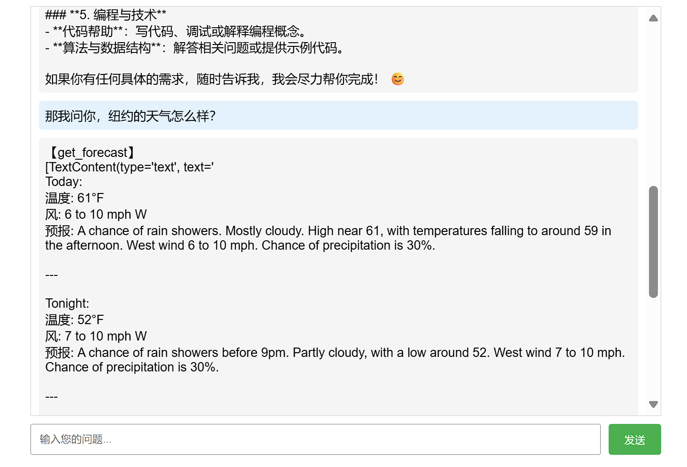

# MCP-Demo
>参考资料:   
[MCP官方中文文档](https://mcp-docs.cn/quickstart/server)

(由于没有US的手机号，拼尽全力也无法获得Claude的可用api，最后只能让AI把客户端部分的代码修改了一下，现在接入的是siliconflow的DeepSeekV3模型。)

**使用方法**:   
先按照官方文档里quickstart里的教程配置一下uv环境，然后创建`mcp-client/.env`并填入`SILICONFLOW_API_KEY=xxx`，最后在`/mcp-client`目录下运行`uv run web_client.py`启动客户端，然后打开`http://localhost:8000/`，就可以和“ ~~(美国)~~ 天气助手”对话了。

> 更新日志：  
5.24 增加了网页端对话
